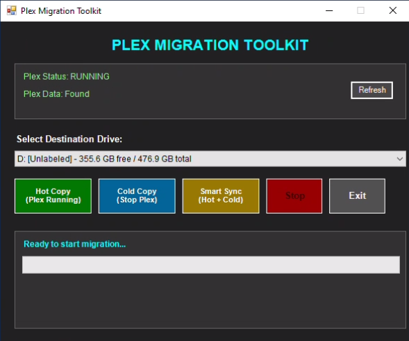

# Plex Migration Toolkit

A Windows PowerShell GUI tool for backing up and migrating Plex Media Server data. Provides both command-line and graphical interfaces for creating reliable backups of your Plex configuration, databases, and metadata.



## Features

### 🖥️ Modern GUI Interface
- Clean, dark-themed Windows Forms interface
- Real-time progress monitoring with visual progress bars
- Live status updates showing Plex service state and data location
- Automatic drive detection with space information
- One-click backup operations

### ⚡ Multiple Copy Modes
- **Hot Copy**: Backup while Plex is running (faster start, good for initial backups)
- **Cold Copy**: Stop Plex temporarily for most reliable backup
- **Smart Sync**: Combines hot copy followed by cold differential sync

### 🔧 Smart Features
- **Differential backups**: Only copies changed files on subsequent runs
- **Automatic Plex service management**: Safely stops and restarts Plex when needed
- **Existing backup detection**: Shows if backups already exist on target drives
- **Detailed logging**: Full robocopy logs saved to destination drive
- **Progress estimation**: Time-based progress updates during long operations

### 📁 What Gets Backed Up
- Plex databases (libraries, watch history, ratings)
- Metadata and artwork cache
- Plugin configurations and data
- User preferences and settings
- **Excludes**: Temporary transcoding files and cache data

## Requirements

- Windows 10/11
- PowerShell 5.0 or later
- Plex Media Server installed
- Additional drive for backup storage
- Administrator privileges (recommended)

## Installation

### Download
1. Download `plex_migration_gui.ps1` from the releases page
2. Save to a folder like `C:\PlexBackup\`

### PowerShell Execution Policy
If you get execution policy errors, run PowerShell as Administrator and execute:
```powershell
Set-ExecutionPolicy -ExecutionPolicy RemoteSigned -Scope CurrentUser
```

## Usage

### GUI Mode (Recommended)
1. Right-click `plex_migration_gui.ps1` → **Run with PowerShell**
2. Or open PowerShell and run: `.\plex_migration_gui.ps1`
3. Select your destination drive from the dropdown
4. Choose your backup method:
   - **Hot Copy**: For quick daily backups
   - **Cold Copy**: For most reliable weekly backups  
   - **Smart Sync**: Best of both worlds
5. Monitor progress in real-time
6. Check completion status and backup size

### Command Line Mode
The original script also supports command-line usage:

```powershell
# Interactive menu
.\plex_migration.ps1

# Direct hot copy to G: drive
.\plex_migration.ps1 -Drive G: -HotCopy

# Direct cold copy to G: drive  
.\plex_migration.ps1 -Drive G: -ColdCopy

# List available drives
.\plex_migration.ps1 -ListDrives
```

## Backup Strategy Recommendations

### First-Time Backup
1. Use **Cold Copy** for the most reliable initial backup
2. Allow 30-60 minutes depending on library size
3. Verify backup completed successfully

### Regular Backups
1. Use **Hot Copy** for quick daily/weekly differential backups
2. Takes only minutes if little has changed
3. Use **Smart Sync** monthly for thorough synchronization

### Before Major Changes
- Always backup before Plex updates
- Backup before changing library locations
- Backup before server migrations

## Migration to New System

### Step 1: Create Backup
1. Run the tool on your current Plex server
2. Use **Cold Copy** for most reliable backup
3. Note the backup location (e.g., `G:\Plex Media Server`)

### Step 2: Transfer to New System
1. Copy the entire backup folder to your new Windows 11 machine
2. Install Plex Media Server on the new system but don't set it up
3. Stop the Plex service: `Stop-Service PlexService`

### Step 3: Restore Data
1. Navigate to `%LOCALAPPDATA%\Plex Media Server\`
2. Delete the default empty folders
3. Copy your backup contents to this location
4. Start Plex service: `Start-Service PlexService`
5. Open Plex - your libraries and settings should be intact

## Troubleshooting

### GUI Won't Start
- Run from PowerShell ISE instead of regular PowerShell
- Check execution policy: `Get-ExecutionPolicy`
- Run as Administrator

### "Plex Data: NOT FOUND"
- Verify Plex is installed and has been run at least once
- Check custom installation paths
- Default location: `%LOCALAPPDATA%\Plex Media Server`

### Copy Operation Fails
- Ensure destination drive has sufficient free space
- Check if Plex files are locked (try Cold Copy mode)
- Review log file on destination drive for detailed errors
- Verify permissions on both source and destination

### Slow Performance
- Hot Copy is faster but may miss locked files
- Cold Copy is slower but most reliable
- Use Smart Sync for best balance
- Close other applications during backup

## Technical Details

### Backup Method
- Uses Windows `robocopy` with mirror mode (`/MIR`)
- Multi-threaded copying (`/MT:8`) for better performance
- Automatic retry on locked files (`/R:3 /W:5`)
- Excludes temporary and cache files

### File Structure
The tool backs up the entire `%LOCALAPPDATA%\Plex Media Server\` directory:
```
Plex Media Server/
├── Plug-in Support/
│   ├── Databases/          # Main Plex database
│   ├── Data/              # Plugin data
│   └── Preferences/       # User settings
├── Media/                 # Metadata cache
├── Metadata/             # Downloaded artwork
└── Cache/                # Temporary files (excluded)
```

## Contributing

Contributions welcome! Please feel free to:
- Report bugs or issues
- Suggest new features
- Submit pull requests
- Improve documentation

## License

This project is licensed under the MIT License - see the [LICENSE](LICENSE) file for details.

## Disclaimer

- Always test backups before relying on them
- This tool is not affiliated with Plex Inc.
- Use at your own risk - always maintain multiple backups
- Verify restored data before deleting original server

## Changelog

### v2.0.0 - GUI Version
- Added modern Windows Forms GUI interface (`plex_migration_gui.ps1`)
- Real-time progress monitoring
- Automatic drive detection
- Visual status indicators
- Improved error handling

### v1.0.0 - Original Script
- Command-line interface (`plex_migration.ps1`)
- Hot/Cold/Smart copy modes
- Basic progress indication
- Robocopy integration

---

**Need Help?** Open an issue on GitHub with:
- Your Windows version
- PowerShell version (`$PSVersionTable.PSVersion`)
- Error messages or screenshots
- Steps to reproduce the problem
